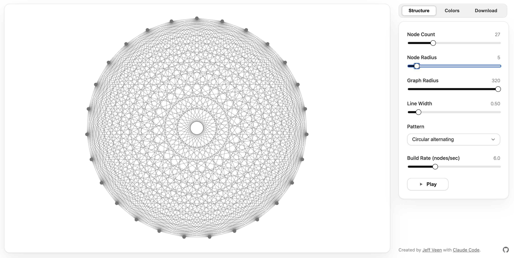

# Metcalfe's Law Visualization Generator

Metcalfe's Law tells us that the value of a network grows with the square of its connections. That quadratic curve outpaces our linear intuition—double the participants and you get far more than double the interactions. This project turns that abstract growth into something you can see and feel instead of just calculating node counts.

## Try it for yourself

Jump straight into the hosted build: https://veen.com/metcalfe-generator/

## Install your own

Set up a local copy if you want to customize, experiment offline, or share a remix.

1. Clone the repository: `git clone https://github.com/veen/metcalfe-generator.git`
2. Serve the project statically from the repo root (for example `python3 -m http.server 8000`).
3. Open `http://localhost:8000/index.html` in any modern browser (Chromium, Firefox, or Safari).

For development work, use Node 18+ to run local tooling and keep everything self-contained—modules in `lib/` and styles in `styles/` are loaded directly in the browser without a bundler.

Licensed under the [MIT License](LICENSE).
